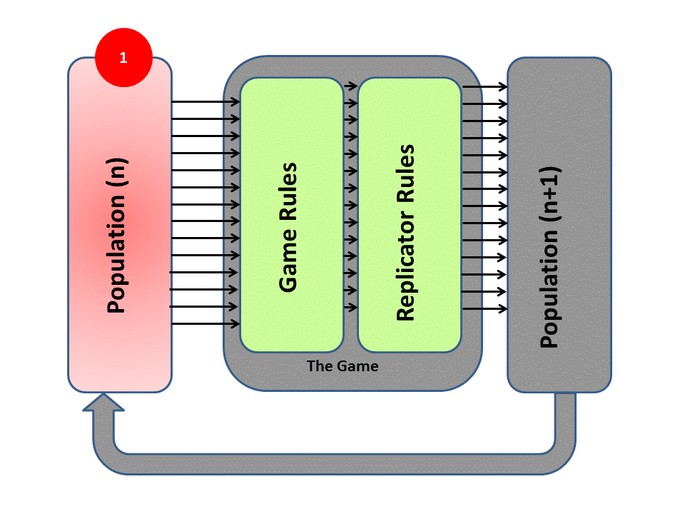
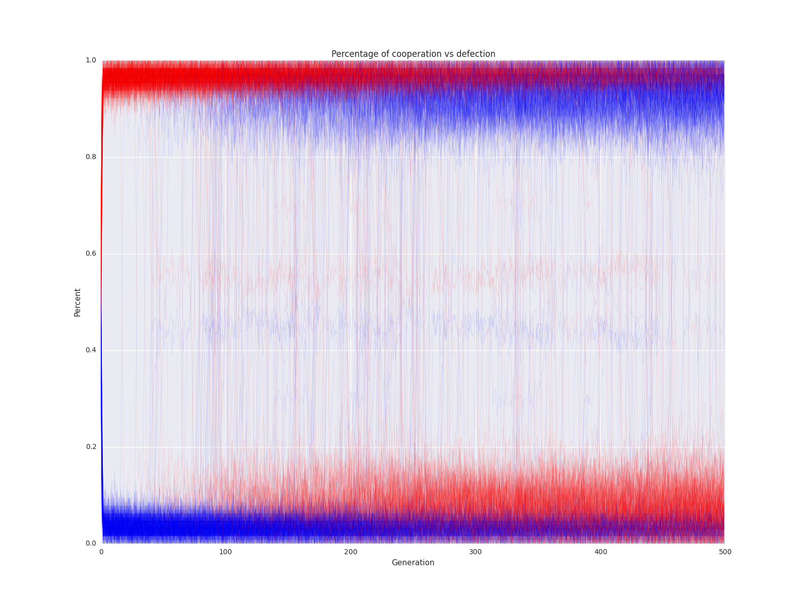

# Evolutionary Game Theory simulations

This is the repository for the students working with Dr. Taylor on evolutionary game theory this Summer (2015).

Current simulations:

    -iterated prisoner's dilema simulation from the AshlockKim paper
  
    -2d agents simulation from the Burtsev paper
    
    
    
___

## Iterated prisoner's dilemma

##### How to use

The main file is IPD_simulation.py, all settings are stored in IPD_functions/IPD_config.py 

Setting the number of simulations to 1 will result in the above html output. Any greater number of simulations will save the data to a json file which can then be used to make graphs with IPD_functions/grapher.py and then viewed in a similar format as above using IPD_functions/viewer.py .

##### Required packages
    -networkx
    -numpy
    -matplotlib
    -pandas
    -seaborn
    
##### Model basics 
The main idea of the simulation can explained nicely by this gif,

"<a href="http://commons.wikimedia.org/wiki/File:Game_Diagram_AniFin.gif#/media/File:Game_Diagram_AniFin.gif">Game Diagram AniFin</a>" by <a href="//commons.wikimedia.org/w/index.php?title=User:HowieKor&amp;action=edit&amp;redlink=1" class="new" title="User:HowieKor (page does not exist)">HowieKor</a> - Own work. Licensed under <a href="http://creativecommons.org/licenses/by-sa/3.0" title="Creative Commons Attribution-Share Alike 3.0">CC BY-SA 3.0</a> via <a href="//commons.wikimedia.org/wiki/">Wikimedia Commons</a>.

A population of agents are randomly paired and then play a 2x2 matrix game a random (exponentially distributed) number of times until moving onto the next partner. Once each agent has been paired with a designated number of partners, all agents are assessed and the highest scoring agents continue onto the next generation as well as their offspring (who undergo a slight mutation to the parent's strategy).

This is then continued for the desired number of generations and logged afterwhich then entie process is repeated again for a desired number of simulations. 

Here is an example using the  <a href="//commons.wikimedia.org/w/index.php?title=User:HowieKor&amp;action=edit&amp;redlink=1" class="new" title="User:HowieKor (page does not exist)">prisoner's dilemma</a> payoff where each simulations data is traced faintly to show the percentage of cooperation(blue) vs defection(red):

##### Understanding the outputs

TODO

